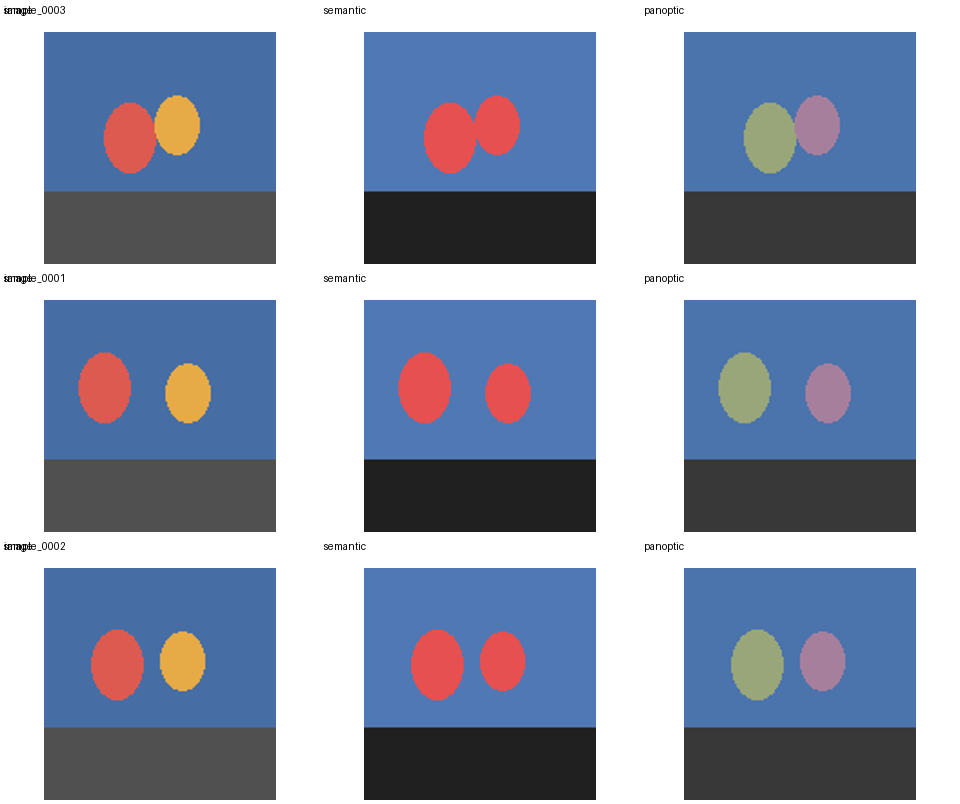

# PyTorch Panoptic Segmentation

[](LICENSE)
[](pyproject.toml)
[](.github/workflows/ci.yml)

[简体中文](README.zh-CN.md) | [Documentation](docs/README.md) | [Kaggle Soccer](docs/guides/kaggle-soccer.md) | [Cityscapes](docs/guides/cityscapes.md)

Learn panoptic segmentation by running and changing a complete PyTorch project. The model predicts semantic classes, object centers, and per-pixel offsets; the decoder turns those outputs into thing instances and stuff regions.



The repository covers the parts that are often omitted from a model-only example: label conversion, split generation, data checks, synchronized transforms, target construction, training, checkpoint resume, PQ evaluation, prediction, and run records.

## Choose a route

| Route | Data | What it is for |
|---|---|---|
| [Synthetic quick start](#synthetic-quick-start) | generated locally | Understand the tensors and verify the whole pipeline on CPU |
| [Kaggle Soccer](docs/guides/kaggle-soccer.md) | public video and polygon annotations | Learn how raw annotations become masks, grouped splits, and a GPU training run |
| [Cityscapes](docs/guides/cityscapes.md) | licensed official data | Study train-ID conversion, official splits, crowd handling, and official evaluation |
| [Your own data](docs/guides/using-your-data.md) | images and labels you provide | Adapt the data format and class schema |

The synthetic and Soccer runs are recorded under [`docs/recorded-run/`](docs/recorded-run/). They show reproducible commands and measured outputs; they are not Cityscapes or COCO leaderboard entries.

## Synthetic quick start

Install Python 3.10-3.12 and [uv](https://docs.astral.sh/uv/), then run:

```bash
uv sync --locked --extra dev
uv run python scripts/create_synthetic_data.py
uv run panoptic-segment prepare-data --schema configs/synthetic_schema.yaml
uv run panoptic-segment inspect-data
uv run python scripts/preview_panoptic.py data/manifests/train.csv \
  --output artifacts/dataset-preview.png --limit 4
uv run panoptic-segment train --config configs/learning_minimal.yaml --dry-run
uv run panoptic-segment train --config configs/learning_minimal.yaml
```

The dry run performs a real forward pass, loss calculation, backward pass, gradient clipping, and optimizer step without creating a normal run directory. The two-epoch training command writes its results to `artifacts/learning-minimal/`.

Evaluate the selected checkpoint and predict one image:

```bash
uv run panoptic-segment evaluate artifacts/learning-minimal/best.pt --split test \
  --output artifacts/learning-minimal/evaluation.json
uv run panoptic-segment predict artifacts/learning-minimal/best.pt \
  data/raw/images/sample_0000.png --output artifacts/prediction
```

Prediction produces machine-readable masks and two images for inspection:

```text
sample_0000.semantic.png
sample_0000.instance.png
sample_0000.semantic-color.png
sample_0000.overlay.png
```

## Data format

Each sample uses one image and two masks with the same filename stem:

```text
data/raw/
  images/sample_0001.png
  semantic/sample_0001.png   # contiguous class ID or 255
  instance/sample_0001.png   # positive ID for things; 0 for stuff and void
```

Within one image, a positive instance ID belongs to one thing class. Thing pixels need a positive instance ID; stuff and ignored pixels use zero. `prepare-data` pairs files and writes deterministic CSV manifests. `inspect-data` checks image decoding, dimensions, class IDs, instance IDs, split counts, file hashes, and group leakage.

For video frames, neighboring crops, or repeated scenes, pass a `sample_id,group_id` CSV to `prepare-data --group-file` so related samples stay in one split. See the [data format reference](docs/reference/data-format.md).

## Change the data or model

To use another dataset:

1. Convert labels to the three-folder format above.
2. Define contiguous class IDs, display colors, and `isthing` values in a schema YAML.
3. Preserve official splits, or use grouped splitting when samples are related.
4. Run `inspect-data` and open a preview before training.
5. Set `data.manifest_dir`, `model.expected_num_classes`, and `loss.ignore_index`.

Start with [Use your own data](docs/guides/using-your-data.md). Converter authors should also read [Adding a dataset](docs/guides/adding-datasets.md).

A replacement model must return:

```text
semantic [B,C,H,W]
center   [B,1,H,W]
offset   [B,2,H,W]
```

Register its factory with `register_model()`, add a config, and test a CPU forward/backward pass. The full procedure is in [Adding a model](docs/guides/adding-models.md).

## Training outputs

Every normal run writes `artifacts/<run_name>/`:

| File | Contents |
|---|---|
| `config.yaml` | Final values used after defaults, YAML, and CLI overrides are merged |
| `run.yaml` | Python, PyTorch, device, Git revision, data fingerprint, and timing |
| `metrics.csv` | Loss components, learning rate, validation PQ/SQ/RQ, thing PQ, and stuff PQ |
| `last.pt` | Latest resumable model, optimizer, scheduler, scaler, RNG, and history |
| `best.pt` | Checkpoint selected by `train.best_metric` |

Resume the same run by increasing the epoch count:

```bash
uv run panoptic-segment train --config configs/learning_minimal.yaml \
  --set train.epochs=4 --resume artifacts/learning-minimal/last.pt
```

The loader uses `torch.load(..., weights_only=True)` and checks checkpoint version, model settings, class schema, and data fingerprint. Do not disable `weights_only` for an untrusted checkpoint.

## Recorded runs

| Run | Data and split | Result |
|---|---|---|
| [Synthetic T4 run](docs/recorded-run/README.md) | 256 generated images, deterministic 205/26/25 split | test PQ `0.853881` |
| [Kaggle Soccer T4 run](docs/recorded-run/kaggle-soccer/README.md) | public CC-BY-SA-4.0 data, split by source video | test PQ `0.223444`, thing PQ `0.000000`, stuff PQ `0.391027` |

The Soccer result is intentionally included even though object separation is poor. Its per-class and per-image files show a realistic failure mode: broad field and background regions are learned much sooner than players, balls, and referees.

## Documentation

| Question | Read |
|---|---|
| Where should I begin? | [Tutorial index](docs/tutorial/README.md) or [learning path](docs/tutorial/learning-path.md) |
| How does one sample move through the code? | [How it works](docs/concepts/how-it-works.md) and [code tour](docs/concepts/code-tour.md) |
| What does each command accept? | [CLI reference](docs/reference/cli.md) |
| What does each config field mean? | [Configuration reference](docs/reference/config-reference.md) |
| Why is a run failing? | [Troubleshooting](docs/guides/troubleshooting.md) |

## Repository layout

```text
configs/                     runnable experiment configurations
docs/tutorial/               concepts in learning order
docs/guides/                 procedures for common tasks
docs/reference/              exact formats, fields, metrics, and checkpoint layout
docs/recorded-run/           measured runs and small result files
examples/                    short programs for targets and model outputs
scripts/                     conversion, preview, evaluation, and Kaggle commands
src/panoptic_segmenter/      installable Python package
tests/                       offline unit and end-to-end tests
```

## Current scope

The included model is a small U-Net trained from scratch. It is suitable for tracing the full pipeline and trying controlled changes, but it is not an implementation of the full Panoptic-DeepLab architecture and is not intended to reach current benchmark accuracy. Pretrained backbones and distributed training are not included. Cityscapes and COCO scores should only be compared after using their official data rules and evaluators.

Run all local checks with:

```bash
make check
```

See [CONTRIBUTING.md](CONTRIBUTING.md) before opening a pull request. Report security issues through [SECURITY.md](SECURITY.md), not a public issue.
